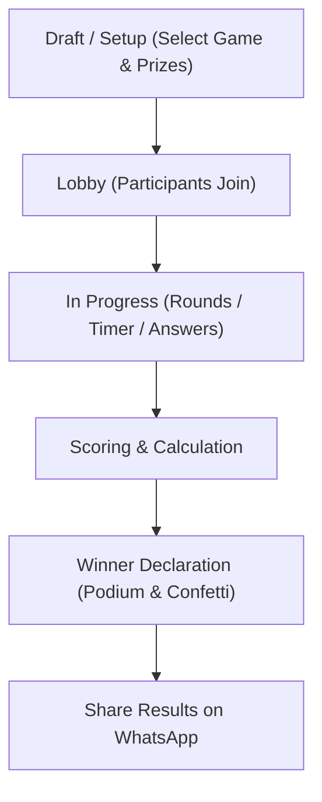

# KittyCircle — Party Games Engine Documentation

> **KittyCircle — Plan. Play. Celebrate.**

The **Party Games Engine** is a core sub-system of KittyCircle designed to make recurring kitty parties interactive, social, and fun. It provides an extensible, state-driven framework for hosting real-time party games without reliance on any Tambola/Bingo mechanics.

---

## 1. Engine Architecture

The game system is built on a clean Dart abstraction:

```text
               PartyGame Interface (lib/features/games/engine/party_game.dart)
                                    ▲
                                    │ (implements)
  ┌─────────────────┬───────────────┼───────────────┬────────────────┐
  │                 │               │               │                │
LuckyDraw       MemoryGame    BollywoodQuiz    EmojiGuess      CustomGame / RapidFire...
```

### Core Abstraction Interface (`PartyGame`)

```dart
abstract class PartyGame {
  GameDefinition get definition;
  GameSessionModel get session;

  void initialize(GameSessionModel session);
  void start();
  void pause();
  void resume();
  void nextRound();
  void submitAnswer(String participantId, dynamic answer);
  void calculateScores();
  List<WinnerModel> determineWinners(List<PrizeModel> prizes);
  void end();
}
```

---

## 2. Built-in Games Catalog

| Game ID | Name | Category | Description | Scoring Rule |
|---|---|---|---|---|
| `game_lucky_draw` | 🎁 Lucky Draw | Chance | Animated wheel/ball pick for party gifts | Pure random assignment |
| `game_memory_challenge` | 🧠 Memory Challenge | Memory | Memorize 10 items shown on screen for 15s | +100 pts per item remembered |
| `game_bollywood_quiz` | 🎬 Bollywood Quiz | Trivia | Fast-paced Bollywood movie & star trivia | +100 pts per correct answer |
| `game_emoji_guess` | 😀 Emoji Guess | Puzzle | Guess popular Hindi proverbs / movie titles | +150 pts per solved puzzle |
| `game_guess_song` | 🎵 Guess the Song | Music | Listen to audio clip / hummed tune | +200 pts for fastest correct guess |
| `game_rapid_fire` | ⚡ Rapid Fire | Speed | 5 quick questions in 30 seconds | +50 pts per fast answer |
| `game_word_challenge` | 🔤 Word Challenge | Vocabulary | Build kitty words from scrambled letter tiles | Points = word length * 20 |
| `game_target_challenge` | 🎯 Target Challenge | Skill | Tap moving festive target on screen | +50 pts per target tap |
| `game_custom` | 🛠️ Custom Game | Host-led | Host inputs offline scores & prize notes | Manual score entry |

---

## 3. Game State Lifecycle Flow



---

## 4. Extending the Engine (Adding New Games)

To add a new party game:

1. Create a class implementing `PartyGame` in `lib/features/games/engine/`:

```dart
class MyNewPartyGame extends PartyGame {
  // Implement lifecycle callbacks
}
```

2. Register the game in `GameEngine.createGame()` factory:

```dart
case 'game_my_new_game':
  return MyNewPartyGame();
```

3. Add definition to default games in `GameEngine.getDefaultGames()`.
